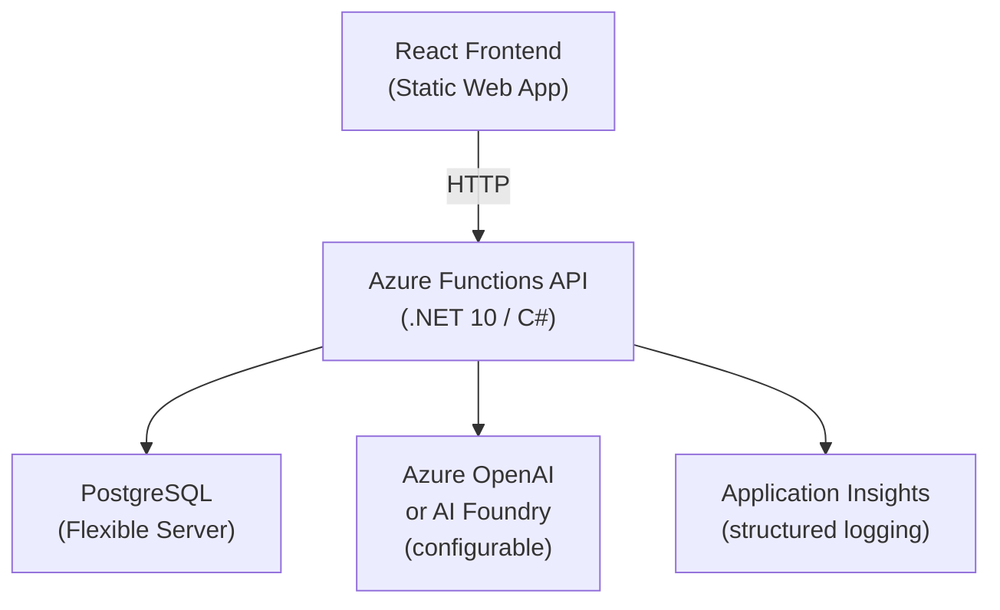

# Demo App Requirements: Task Library

**Version:** 0.1  
**Status:** Draft  
**Purpose:** Live demo application for *Agentic-First with GitHub Copilot* — Global Azure Columbus 2026

---

## Overview

A task management application that demonstrates a realistic, modern Azure architecture deployable end-to-end by the Copilot coding agent using Azure Skills. The LLM integration showcases agentic-first thinking applied to the product itself — not just the development workflow.

**The demo story:** Start from a GitHub issue, watch Copilot write the code, wire up Azure infrastructure, deploy, and open a PR — all narrated live.

---

## Architecture



---

## Azure Resources

| Resource | SKU (demo) | Purpose |
|---|---|---|
| Azure Static Web Apps | Free | Host React frontend |
| Azure Functions | Flex Consumption | API / backend logic |
| Azure Database for PostgreSQL Flexible Server | Burstable B1ms | Task storage |
| Azure OpenAI Service *or* Azure AI Foundry | gpt-4o-mini | Categorization + priority |
| Application Insights | Pay-as-you-go | Structured logging, telemetry |
| Azure Key Vault | Standard | Secrets (connection strings, API keys) |

---

## Functional Requirements

### Tasks

- **FR-01** A task has: `id`, `title`, `description`, `status`, `priority`, `category`, `createdAt`, `updatedAt`
- **FR-02** Status values: `Backlog` | `InProgress` | `Done`
- **FR-03** Priority values: `Low` | `Medium` | `High` | `Critical`
- **FR-04** Category is a free-form string (LLM-suggested, user-editable)
- **FR-05** Users can create, view, update, and delete tasks
- **FR-06** Users can filter tasks by status, priority, and category
- **FR-07** Users can manually override LLM-suggested category and priority at any time

### LLM Integration — Auto-Categorization and Priority

- **FR-10** When a task is created or its title/description is updated, the system automatically invokes the LLM to suggest a `category` and `priority`
- **FR-11** The LLM prompt includes the task title and description; the response is a structured JSON object `{ "category": string, "priority": "Low"|"Medium"|"High"|"Critical", "reasoning": string }`
- **FR-12** LLM suggestions are applied automatically but surfaced visually as "AI suggested" until the user confirms or overrides
- **FR-13** The LLM endpoint is configurable via environment variable — supports both Azure OpenAI and Azure AI Foundry deployments
- **FR-14** LLM failures are non-fatal: the task is saved without suggestion, and the error is logged to App Insights

### Observability

- **FR-20** All Azure Functions use structured logging via `ILogger<T>` with App Insights sink
- **FR-21** Every request logs: operation name, task ID (if applicable), duration, and outcome
- **FR-22** LLM calls log: model used, prompt token count, completion token count, latency, and success/failure
- **FR-23** Database operations log: operation type, duration, and row count
- **FR-24** All logs include a `correlationId` for end-to-end tracing across frontend → function → database/LLM

---

## Non-Functional Requirements

- **NFR-01** The API is stateless; all state lives in PostgreSQL
- **NFR-02** Secrets are never stored in code or `local.settings.json` committed to source — all secrets via Key Vault references
- **NFR-03** The application must be deployable end-to-end with `azd up` from a clean environment
- **NFR-04** `azure.yaml` defines all resources; infrastructure is code-first (Bicep)
- **NFR-05** The React frontend communicates with the Functions API only — no direct database access
- **NFR-06** CORS is configured to allow the Static Web App origin

---

## API Endpoints (Azure Functions)

| Method | Route | Description |
|---|---|---|
| `GET` | `/api/tasks` | List all tasks (supports `?status=`, `?priority=`, `?category=` filters) |
| `GET` | `/api/tasks/{id}` | Get a single task |
| `POST` | `/api/tasks` | Create a task (triggers LLM suggestion async) |
| `PUT` | `/api/tasks/{id}` | Update a task (re-triggers LLM if title/description changed) |
| `DELETE` | `/api/tasks/{id}` | Delete a task |
| `POST` | `/api/tasks/{id}/suggest` | Manually re-trigger LLM suggestion for a task |

---

## React Frontend

- **UI-01** Single-page app using React 18+ with TypeScript
- **UI-02** Task list view: sortable columns, filter bar (status, priority, category)
- **UI-03** Task detail / edit panel (slide-out or modal)
- **UI-04** Visual indicator on tasks with unconfirmed AI suggestions (e.g. ✨ badge)
- **UI-05** Inline confirm/override controls for AI-suggested category and priority
- **UI-06** No CSS framework mandated — keep it simple and demo-readable

---

## Data Model

```sql
CREATE TABLE tasks (
    id          UUID PRIMARY KEY DEFAULT gen_random_uuid(),
    title       VARCHAR(255) NOT NULL,
    description TEXT,
    status      VARCHAR(20)  NOT NULL DEFAULT 'Backlog',
    priority    VARCHAR(20)  NOT NULL DEFAULT 'Medium',
    category    VARCHAR(100),
    ai_suggested_priority  VARCHAR(20),
    ai_suggested_category  VARCHAR(100),
    ai_reasoning           TEXT,
    ai_suggestion_confirmed BOOLEAN DEFAULT FALSE,
    created_at  TIMESTAMPTZ NOT NULL DEFAULT NOW(),
    updated_at  TIMESTAMPTZ NOT NULL DEFAULT NOW()
);
```

---

## `azure.yaml` Resource Map

```
services:
  api:       Azure Functions (.NET 10 isolated)
  web:       Azure Static Web Apps (React)

infrastructure:
  provider:  bicep
  path:      infra/

resources:
  - PostgreSQL Flexible Server
  - Azure OpenAI (or AI Foundry endpoint)
  - Application Insights + Log Analytics Workspace
  - Key Vault
```

---

## Demo Script Alignment

| Demo step | App feature shown |
|---|---|
| Coding agent writes code from issue | Functions API + React scaffold |
| Azure Skills `azure-prepare` | Generates `Dockerfile`, `azure.yaml`, Bicep infra |
| Azure Skills `azure-validate` | Pre-flight checks on resources, quotas, permissions |
| Azure Skills `azure-deploy` | `azd up` deploys everything end-to-end |
| App Insights in portal | Structured logs from LLM calls visible live |
| PR opened by agent | Full diff: API + frontend + infra-as-code |

---

## Out of Scope (for demo)

- Authentication / authorization
- Multi-user / multi-tenant
- Task assignments or comments
- Real-time updates (WebSockets / SignalR)
- CI/CD pipeline (GitHub Actions)
